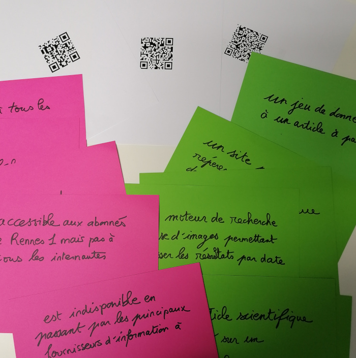

# Contexte 

Le SCD de Rennes 1 est investi depuis des années dans la formation des étudiants de deuxième année de Master MEQS (méthode d'évaluation de la qualité et de la sécurité des soins). Le groupe est constitué de 8 à 10 personnes.

L'apport du SCD se fait en trois temps : 

- 3 heures sur la recherche d'information dans les moteurs de recherche spécialisés (Google Scholar et Pubmed)  
- 3 heures de recherche sur la veille    
- 2,5 heures de formation à l'outil Zotero. 

L'ensemble du contenu de ces séances est répertoriée sur le site [Focus](https://focus.univ-rennes1.fr/MEQS_2022), consulter l'archive de cette page (back_up_focus.htm) également en ligne sur les serveurs d'[Internet Archive](https://archive.org/details/back_up_focus)

La séance présentée ici est la deuxième (veille)

# Objectifs

- Identifier quelques outils documentaires, leur intérêt, leur accessibilité  
- maîtriser la recherche inverse d'images  
- Comprendre la démarche de la veille et l'intérêt d'automatiser le processus  
- utiliser les réseaux sociaux pour faire de la veille  
- utiliser un agrégateur de flux RSS  
- gérer des flux RSS de manière experte  
- Faire de la veille avec Pubmed 

